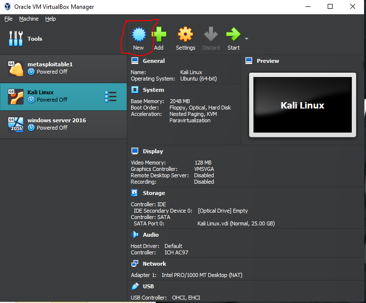
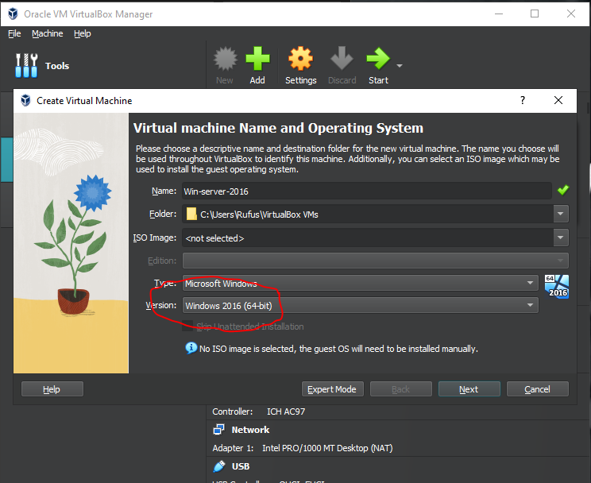
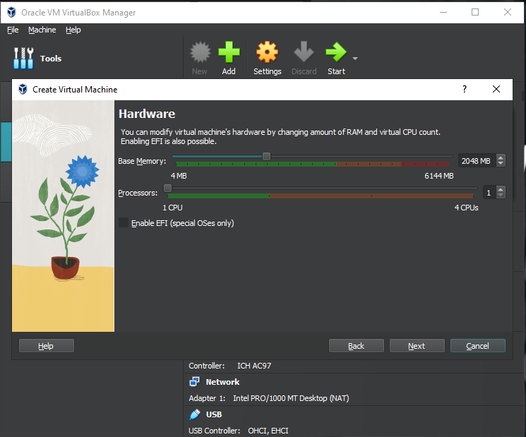
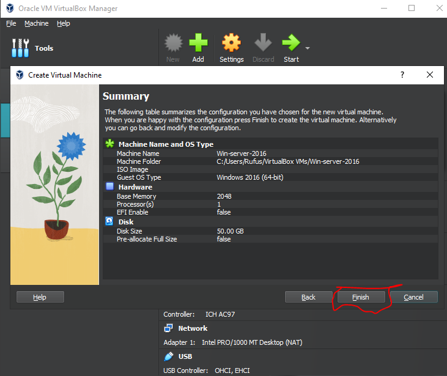
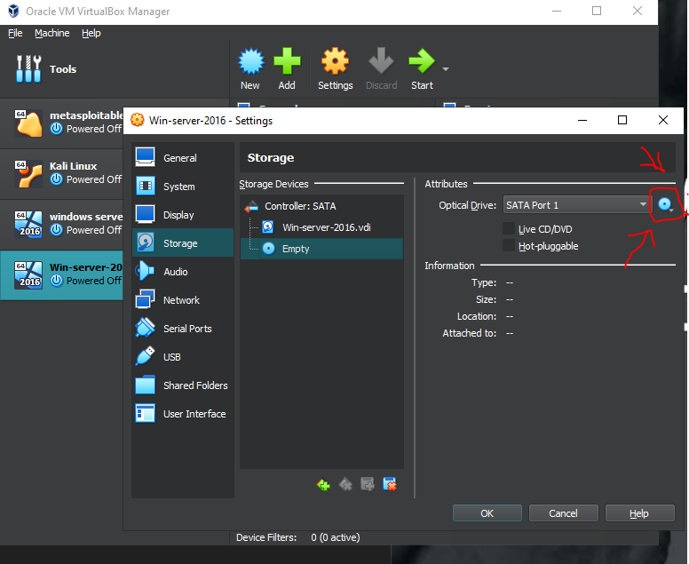
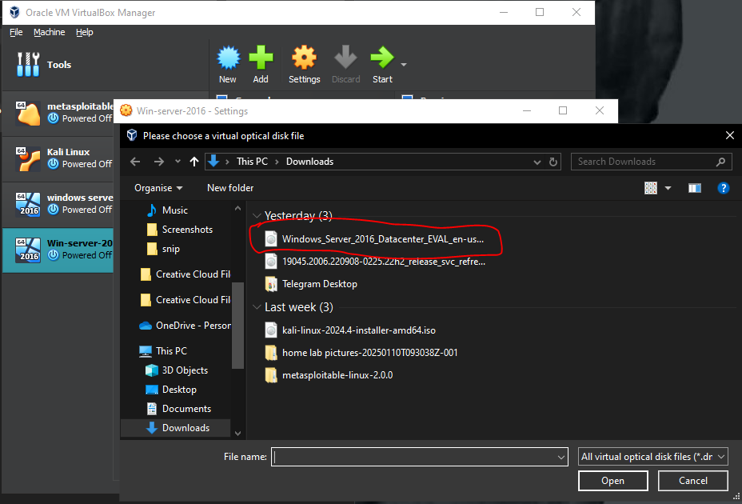
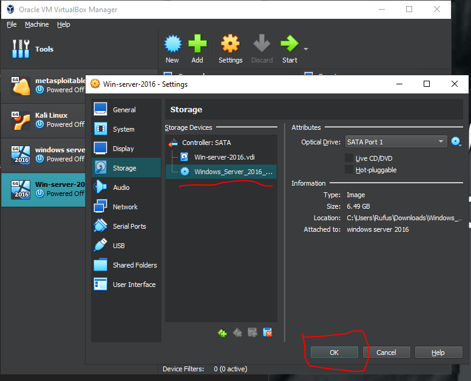

# Installing-Windows-Server-2016-on-virtual-box-

<h1>Step 1 : Download Windows Server 2016 ISO</h1>
<a href="https://www.microsoft.com/en-us/evalcenter/download-windows-server-2016">Click here</a> to visit the Official Microsoft site and download Windows Server 2016 ISO 60-bit edition and start the download.

<h1>Step 2: Create a New Virtual Machine</h1>
If you haven’t downloaded and installed virtual box, I have created a guide here  on how to go about it. Open Virtual-box and click on ‘New’ to create a new virtual machine.

<h2>Name your machine:</h2>
You are at liberty to call it ‘windows server 2016 ’ and it should automatically change the version to windows 2016 64-bit, so make sure that's highlighted if it didn't automatically do it.

<h2>Create a Virtual Hard-disk:</h2>
Recommended to have at least 2GB of Base Memory. You could increase if your system has more resources.

Cycle through and complete by clicking Finish to create your virtual machine.

<h2>Configure VM settings:</h2>
Next go to the Virtual Machine ‘settings’ go to the storage tab, empty disk, locating where you downloaded server 2016 ISO and get it inserted. Then click OK.

<h1>Step 3: Start up the virtual machine</h1>
Click 'Start' to start the virtual machine, or rather start installing the server.

<h2>Setting Up Windows Server 2016:</h2>
It loads a blue boot screen then the setup screen
Pick the language, time and keyboard formats as you need, hit next then hit install now

It will ask which version to pick. Pick the ones with desktop experience, choose the server 2016 standard with desktop experience and hit next 

Agree with the license terms, hit next

Type of install, choose custom

Make sure the drive is selected, hit next

It will go through the install and when done, let it restart. Click nothing as it boots-up into the setup, let it finish

Set up password for the administrator account. 

>input>keyboard>insert ctrl, alt, delete to unlock

Enter the password as it logs in the account for the first time

Then finally the desktop will load up

